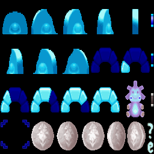
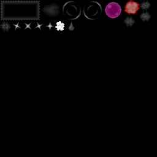
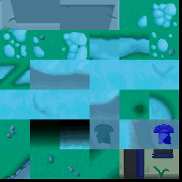
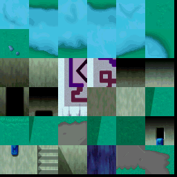
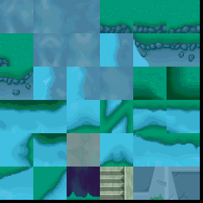
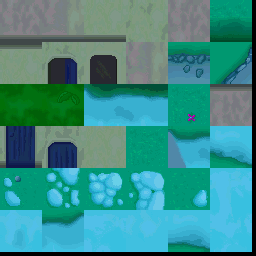
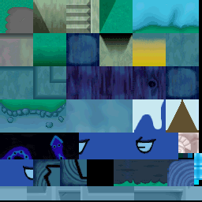
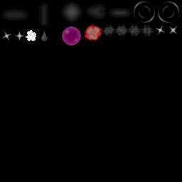
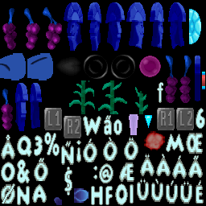

# ENG---reverse-engineering

This project is an attempt to reverse engineer the file formats of the old PC game "The Emperor's New Groove"
So far only the texture file formats have been successfully reverse engineered. 

Below are some textures that have been extracted from the files of the game:

     
   
  
